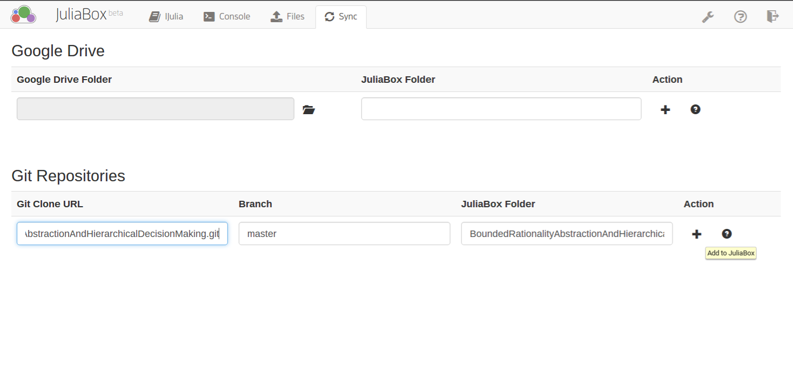

# Bounded rationality, abstraction and hierarchical decision-making: an information-theoretic optimality principle
Supplementary code and Jupyter notebooks for publication: Bounded rationality, abstraction and hierarchical decision-making: an information-theoretic optimality principle

## Using the notebooks
If you are unfamiliar with Jupyter notebooks it is strongly suggested that you have a look [here]( http://jupyter-notebook-beginner-guide.readthedocs.org/en/latest/index.html)

The easiest and installation-free method of using the notebooks provided here is through JuliaBox. Alternatively Julia and IJulia must be installed (besides Jupyter) along with a few Julia packages.

Alternatively, you can view a static HTML rendering of the notebook (which means that you can not change any parameters) through [nbviewer](http://nbviewer.ipython.org/github/tgenewein/BoundedRationalityAbstractionAndHierarchicalDecisionMaking/tree/master/NotebooksAndCode/)

### Usage through JuliaBox

*  Go to [JuliaBox](https://www.juliabox.org/) and sign in with your Google account (currently only Google accounts are supported).
*  At the very top of the JuliaBox window, select the ``Sync`` tab.
*  Under ``Git Repositories`` you can simply clone this repository to a folder in JuliaBox
*  To do so enter the HTTPS-URL of this repository in the first field on JuliaBox
  *  The URL can be found on the [landing-page](https://github.com/tgenewein/BoundedRationalityAbstractionAndHierarchicalDecisionMaking) of this repository on GitHub in the right bar of the web-page
  *  It should give you: ``https://github.com/tgenewein/BoundedRationalityAbstractionAndHierarchicalDecisionMaking.git``
*  Select the branch ``master`` in the second edit-field of JuliaBox and specify a local folder name in the third edit-field.
*  Finally click the plus sign to clone the repository.
  *  It should look like this: 
  

Alternatively, you can use the ``Console`` tab in JuliaBox to get a shell and clone the repository with standard git commands.

If you completed this successfully, you should see a new folder under the ``IJulia`` tab that contains the contents of the repository, including the notebooks. Simply select a notebook by clicking on it and it opens in a new tab.

### Usage with IJulia installation

Install IJulia by following the instructions [here](https://github.com/JuliaLang/IJulia.jl)

This will require you to
*  Install Jupyter (preferably through anaconda)
*  Install Julia
*  Install IJulia

Download the contents of this repository
*  [.zip](https://github.com/tgenewein/BoundedRationalityAbstractionAndHierarchicalDecisionMaking/archive/master.zip)
*  Unpack the zip-file to some destination-folder

Or alternatively, clone/fork the repository using git.

Navigate to the folder that contains the repository contents and start a new notebook server (typically by opening a console and typing: ``jupyter notebook``). A new browser tab should open and you can open notebooks by clicking on them.

## I've never used a Jupyter notebook before...
The notebooks are very simple to use - you can get an overwiew by clicking on ``Help -> User Interface Tour`` in any running notebook (in the browser). It might be best to run all cells after opening a notebook (by selecting ``Cell -> Run all``). Note that the first run (of any function) in Julia can take quite a bit longer (because the function gets JIT compiled).
